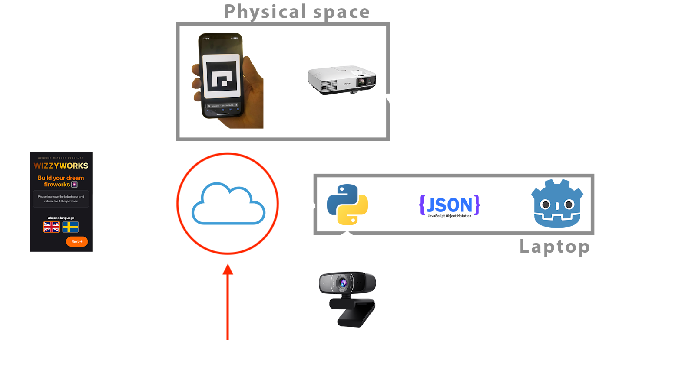

# WizzyWorks Server

This is the WebSocket server what uses WebSockets to communicate with multiple clients, including the WizzyWorks Webapp and the WizzyWorks Bridge. And this is part of the WizzyWorks virtual firework experience from the course DH2413 Advanced Graphics and Interaction in KTH, 2025.

It is intended for this system to run alongside other components of the WizzyWorks project, as shown in the diagram below. The server will relay any messages sent by the Webapp to the Bridge and vice versa. Ideally the server should be deployed to a public server that can be accessed by the WizzyWorks Webapp and the WizzyWorks Bridge, but it can also be run locally for development purposes.



## Features

- WebSocket server on port 8765
- WizzyWorks webapp can connect as clients
- WizzyWorks bridge can connect as bridge
- Relaying information between the clients and the bridge
- HTTP health check server on port 8000
- CORS support for web clients
- Client ID management with reusable IDs

## Docker Deployment

### Quick Start

1. **Using Docker Compose (Recommended)**:
```bash
docker-compose up -d
```

2. **Using Docker directly**:
```bash
# Build the image
docker build -t wizzyworks-server .

# Run the container
docker run -d -p 8765:8765 -p 8000:8000 --name wizzyworks-server wizzyworks-server
```

### Docker Commands

- **View logs**: `docker logs wizzyworks-server`
- **Stop container**: `docker stop wizzyworks-server`
- **Remove container**: `docker rm wizzyworks-server`
- **Restart**: `docker restart wizzyworks-server`

### Port Configuration

- **8765**: WebSocket server port
- **8000**: HTTP health check server port

Both ports are exposed and can be accessed via:
- WebSocket: `ws://localhost:8765`
- Health check: `http://localhost:8000/health`

The health check endpoint provides JSON status information, including the number of connected clients and bridge connection status.

## Local Development

If you want to run without Docker:

1. Install dependencies:
```bash
pip install -r requirements.txt
```

2. Run the server:
```bash
cd server
python server.py
```

## Configuration

The server accepts connections from the following origins by default:
- `https://wizzyworks-frontend.vercel.app`
- `http://localhost:3000-3001`
- `http://127.0.0.1:3000-3001`
- `http://localhost:8000`
- `http://127.0.0.1:8000`

Additional origins can be configured in the `ALLOWED_ORIGINS` list in `server.py`.
